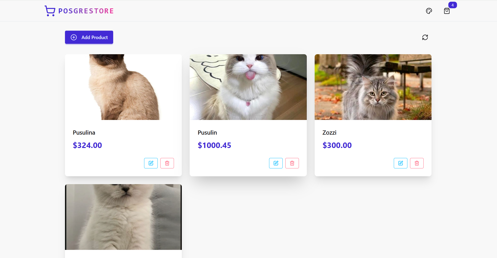
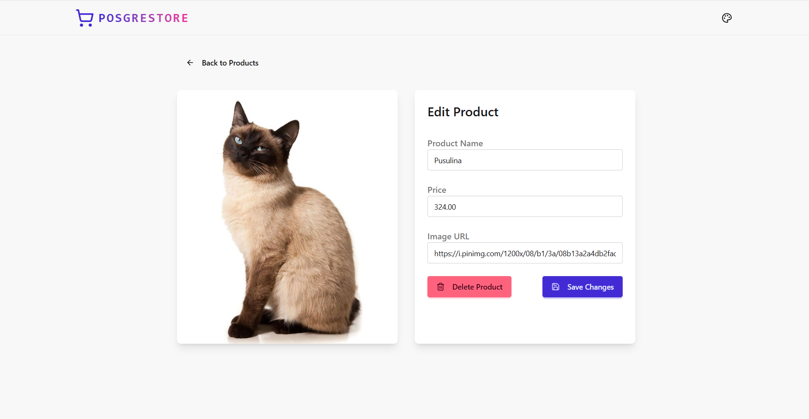
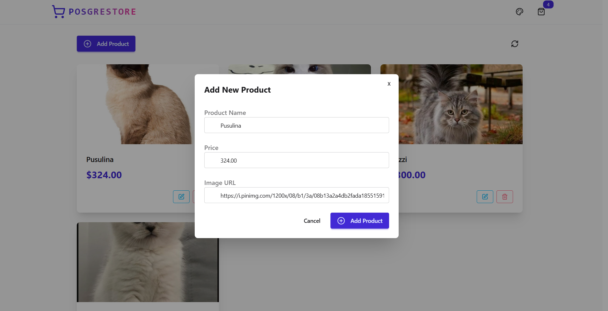

# 🛒 Full-Stack eCommerce Store (PERN Stack)

A simple full-stack eCommerce application built using **PostgreSQL**, **Express.js**, **React.js**, and **Node.js**. The application allows users to view products, see detailed information for each product, and (as an admin) add or edit products.

---

## 📸 Screenshots

### 🔹 Homepage

---

### 🔹 Product Details Page

---

### 🔹 Add/Edit Product Page

---

## ⚙️ Technologies Used

- **Frontend:** React, React Router, Axios
- **Backend:** Express.js, Node.js
- **Database:** PostgreSQL
- **Others:** CORS, dotenv, nodemon

---

## 🚀 Features

- Display all products on the homepage
- View product details on a separate page
- Add or edit products (admin functionality)
- RESTful API built with Express.js
- PostgreSQL integration for storing product data
- Organized architecture using `client/` and `server/` folders

---

## 🧱 Project Structure

