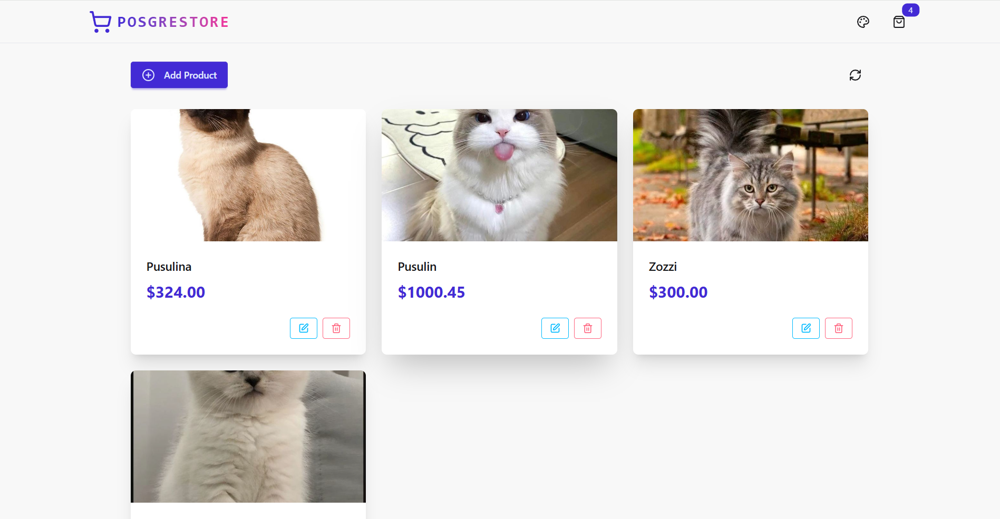
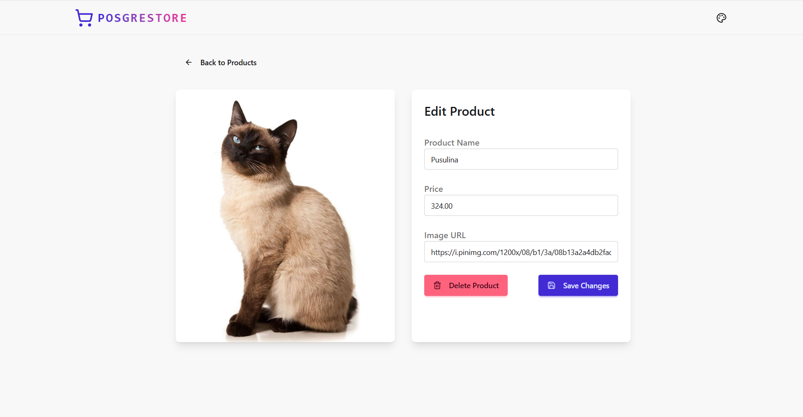
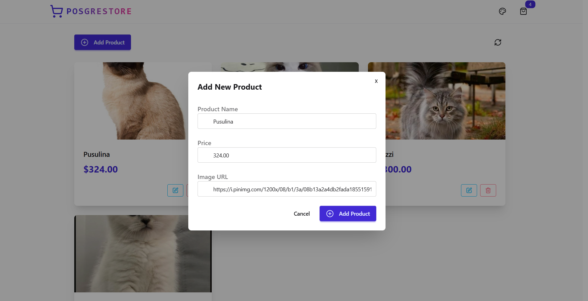

# 🛒 Full-Stack eCommerce Store (PERN Stack)

Un magazin online complet realizat cu **PostgreSQL**, **Express.js**, **React.js** și **Node.js**. Aplicația permite vizualizarea produselor, detalii pentru fiecare produs și editarea produselor (funcționalitate de admin).

---

## 📸 Capturi de ecran

### 🔹 Pagina principală (Home)

---

### 🔹 Pagina produsului

---

### 🔹 Editare produs

---

## ⚙️ Tehnologii utilizate

- **Frontend:** React, React Router, Axios
- **Backend:** Express.js, Node.js
- **Baza de date:** PostgreSQL
- **Altele:** CORS, dotenv, nodemon

---

## 🚀 Funcționalități

- Afișare produse pe homepage
- Vizualizare detalii produs
- Editare produs (admin)
- API RESTful
- Conexiune cu baza de date PostgreSQL
- Arhitectură organizată pe `client/` și `server/`

---

## 🧱 Structura proiectului

